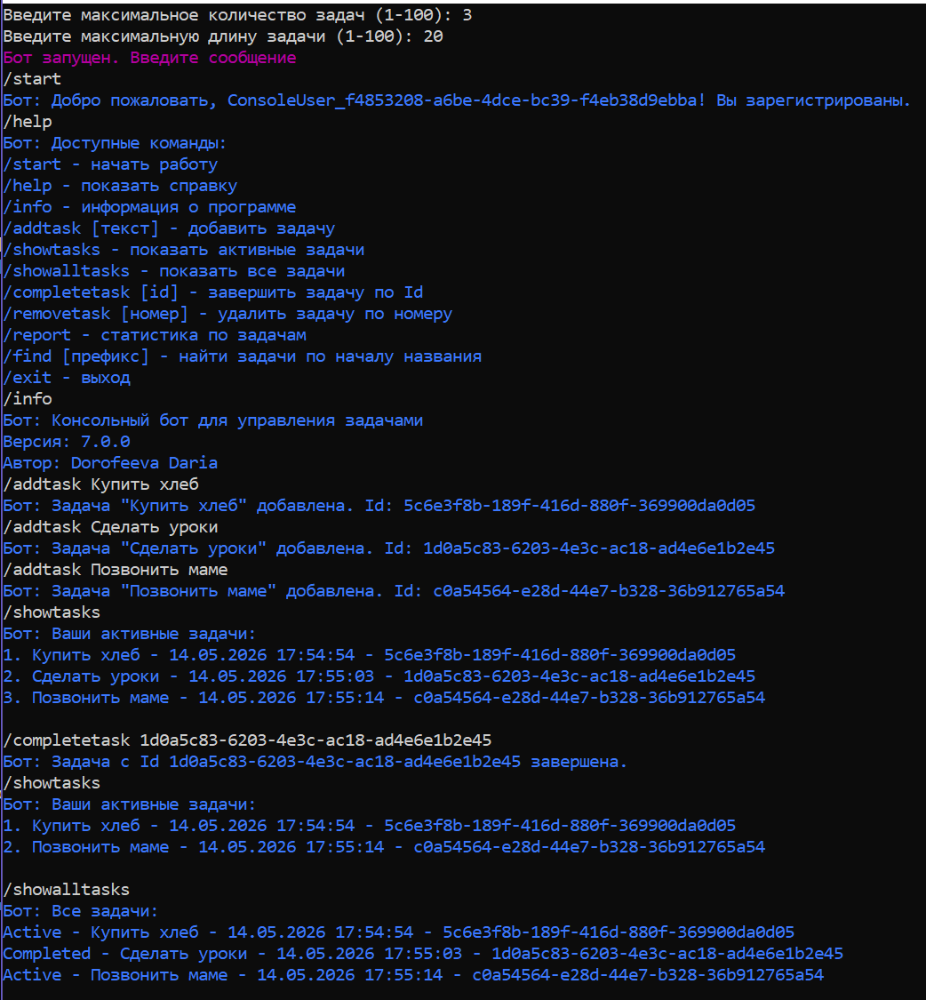
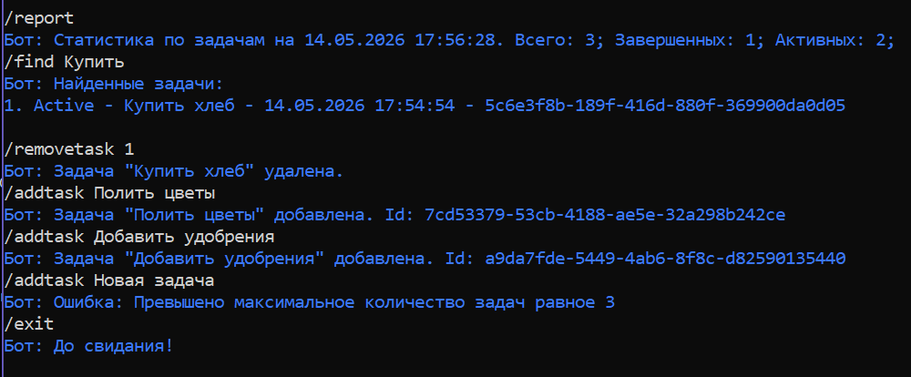

# 📝 Консольный бот: репозитории и отчёты

## 📋 Описание
Консольный бот для управления задачами с поддержкой:
- Регистрации пользователей
- Добавления, выполнения, удаления задач
- Поиска задач по префиксу
- Статистики по задачам

## 🆕 Что нового (ДЗ №6)
- ✅ Разделение на слои: `Core` (сущности, интерфейсы), `Infrastructure` (репозитории), `TelegramBot` (обработчик)
- ✅ Интерфейсы репозиториев `IUserRepository`, `IToDoRepository`
- ✅ Реализация `InMemoryUserRepository`, `InMemoryToDoRepository`
- ✅ Команда `/report` — статистика по задачам (кортежи)
- ✅ Команда `/find` — поиск задач по префиксу (лямбды)
- ✅ Обновлённая справка `/help`

## 🎮 Доступные команды
| Команда | Описание |
|---------|----------|
| `/start` | Начать работу (авторегистрация) |
| `/help` | Показать справку |
| `/info` | Информация о программе |
| `/addtask [текст]` | Добавить задачу |
| `/showtasks` | Показать активные задачи |
| `/showalltasks` | Показать все задачи |
| `/completetask [id]` | Завершить задачу по Id |
| `/removetask [номер]` | Удалить задачу по номеру |
| `/report` | Статистика |
| `/find` | Поиск по началу названия |
| `/exit` | Выход |

## 📸 Демонстрация работы
| Основной сценарий | Статистика и поиск |
|---|---|
|  |  |

## 👤 Автор  
Дорофеева Дарья   
Дата: 14.05.2026

## 📄 Лицензия
MIT License